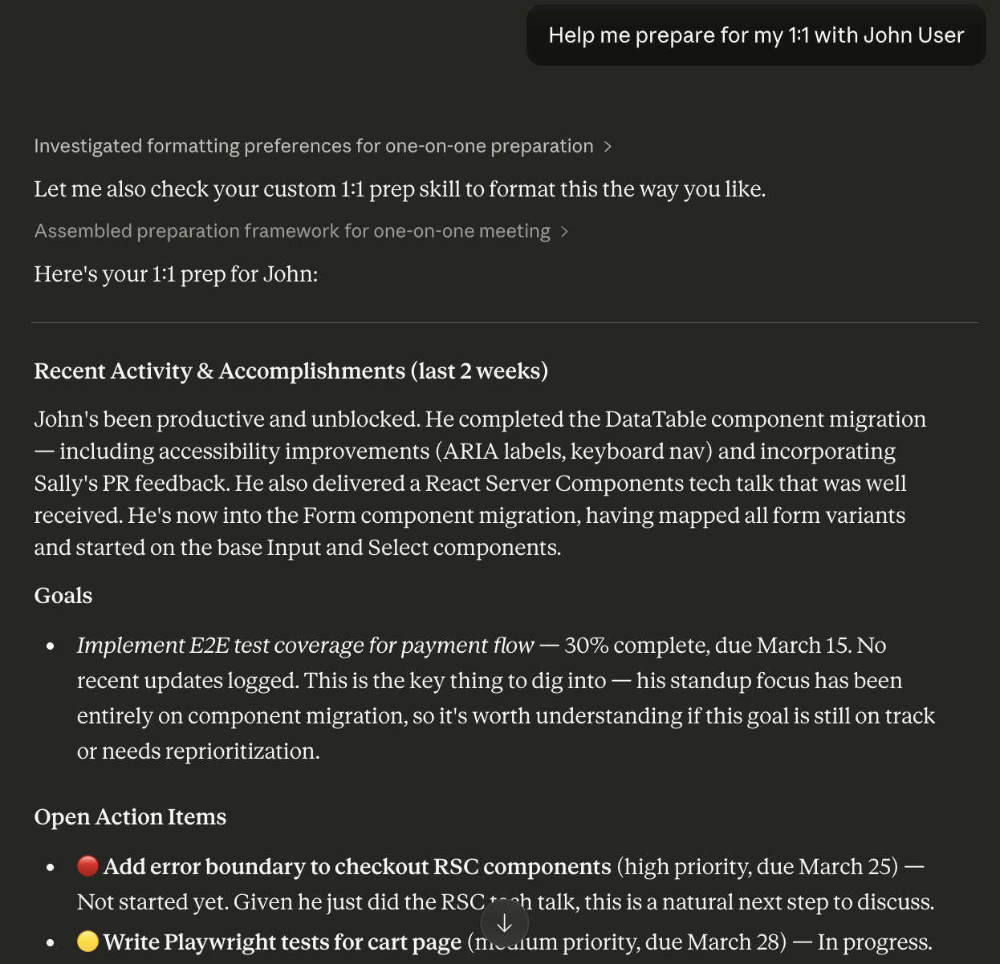
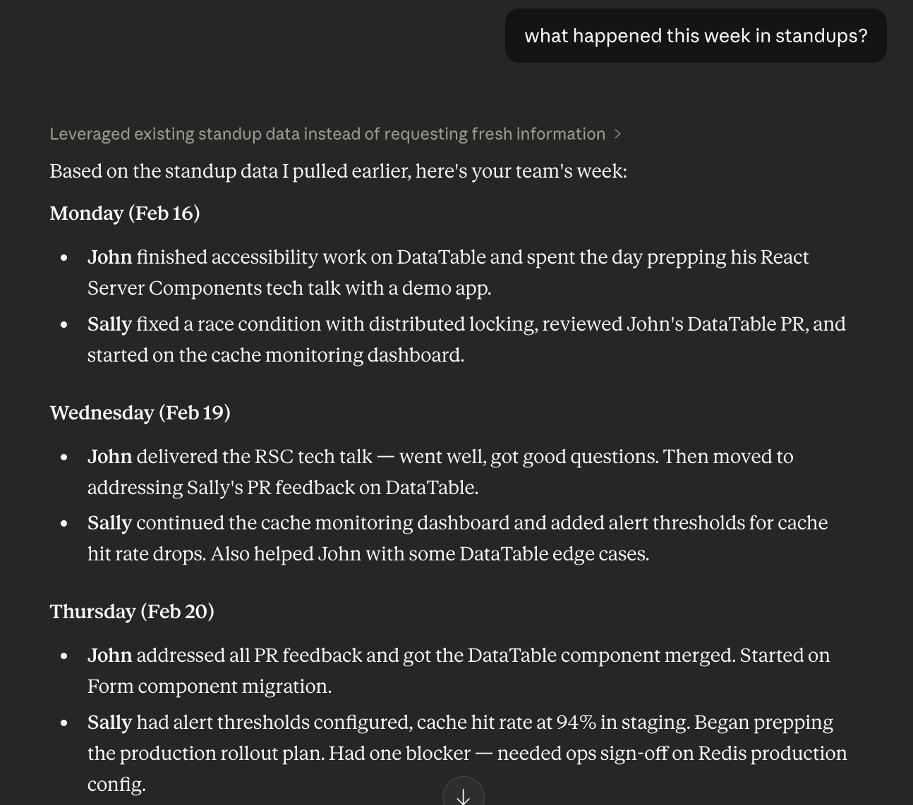
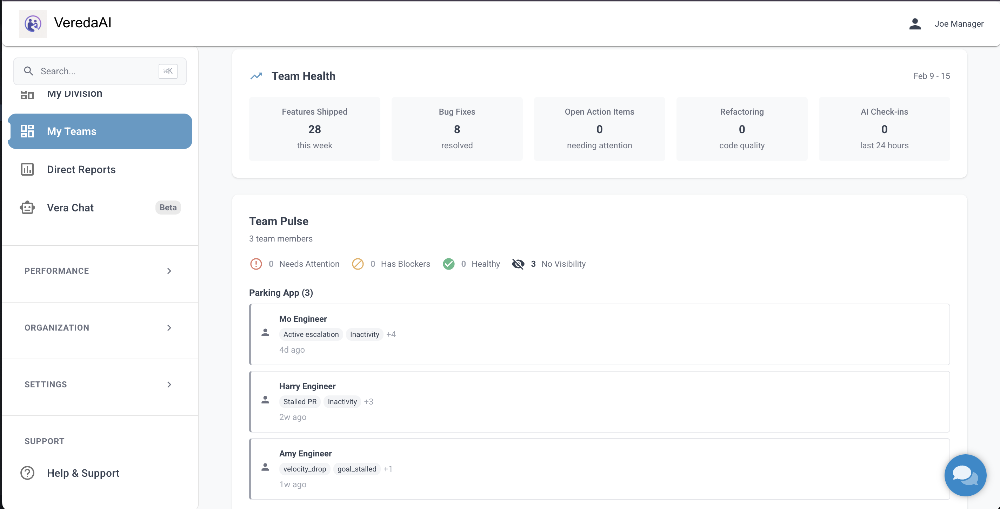
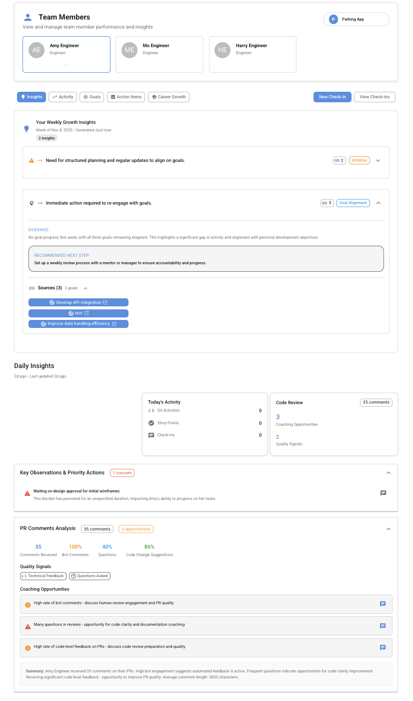

# Vereda AI — MCP Server for Claude

Connect Claude to your engineering team's performance data. Ask about standups, prepare for 1:1s, track goals, detect burnout risk, and manage action items — all from Claude.

**Server URL:** `https://app.vereda.ai/api/mcp`

## See It in Action

### 1:1 Prep

> "Help me prepare for my 1:1 with John User"

Claude pulls recent standups, goal progress, open action items, and sentiment data into structured talking points.

### Standup Summary

> "What happened this week in standups?"

Claude aggregates standup responses across the week with per-engineer breakdowns and blocker detection.

### Team Dashboard

The Vereda platform gives you a real-time view of team health, delivery metrics, and risk signals — the same data Claude accesses through MCP.

### Engineer Insights

AI-generated insights surface coaching opportunities, goal alignment issues, and PR review patterns for each engineer.

## Features

### Natural Language Questions

Ask Claude anything about your team members. Vereda fetches comprehensive data — goals, action items, check-ins, git activity, Jira/Linear tickets, and daily insights — and synthesizes a direct answer.

> "What blockers has Sarah mentioned this week?"
> "Is Jake making progress on the API migration?"
> "How has Maria's sentiment been lately?"

### 1:1 and Performance Review Prep

Generate structured talking points for 1:1s and formal performance reviews. Review prep covers configurable time periods (quarterly, annual) and includes competency gap analysis against your career ladder.

- Recent activity summary (PRs, commits, tickets, standups)
- Goal progress with at-risk detection
- Open action items and overdue tasks
- AI-generated insights and coaching suggestions
- Manager's private notes
- Competency expectations and promotion gap analysis (review prep)

### Standup Aggregation

Get full standup content for your team or individual engineers. Supports Slack and web standups with participation tracking and blocker detection. Configurable lookback up to 30 days.

### Team Health and Risk Signals

- **Team health summary** — Delivery stats, standup participation, blocker counts, and AI-generated team insights
- **Needs attention** — Engineers flagged by active signals and escalations with conversation starters
- **Risk analysis** — Daily risk scores (0-100) per engineer across categories: activity gaps, sentiment decline, velocity decrease, blocker accumulation
- **Team patterns** — Shared blockers, behavioral patterns, positive signals (velocity increases, goal completions, sentiment improvements), and coaching opportunities

### Pulse Surveys

Access anonymized, aggregated pulse survey results across your organization or by team. Tracks engagement, satisfaction, manager relationship, growth, and work-life balance over multiple periods with AI-generated themes. Individual responses are never exposed.

### Career Development Context

View an engineer's current level, competency expectations, full career ladder, and next-level requirements with gap analysis. Includes AI-generated career discussion prompts.

### Goal Management

Create and track career development goals. Goals support SMART criteria validation — if a goal is missing specificity, measurability, or a deadline, Claude will prompt for the missing fields before creating it.

- Fuzzy name and title matching (find goals by partial name or keywords)
- Progress notes with sentiment tracking
- Link goals to competency topics from your career ladder
- Priority levels and quarter labels

### Action Items

Create, update, and list short-term tasks and follow-ups. Action items can be linked to goals, have due dates (natural language supported — "Friday", "next week", "in 3 days"), and severity levels.

- Overdue detection
- Status tracking (active, in progress, completed, cancelled)
- Fuzzy matching by engineer name and title keywords

### Check-In Notes

Add shared or private notes to 1:1 check-ins. Automatically surfaces outstanding items: goals not updated in 14+ days, overdue goals, and overdue/high-priority action items.

### Private Notes

Save, search, and list private manager notes. Notes are automatically tagged with people, projects, topics, and links in the background. Search uses natural language and returns AI-synthesized summaries cross-referenced with check-ins, action items, and goals.

### Integrations

Vereda pulls data from your existing tools so Claude has the full picture:

- **Slack** — Standup collection via bot (DM or channel threads), slash commands
- **GitHub** — PR activity, commits, review comments (read-only)
- **Jira** — Issue tracking, story points, sprint data (read-only)
- **Linear** — Issue tracking (read-only)

### Smart Matching

All tools support fuzzy name matching — you can refer to engineers by first name, last name, or partial name. Goal and action item lookups work by title keywords, not just IDs.

## Available Tools (20)

### Read Tools

| Tool | Description |
|---|---|
| `ask_about_engineer` | Natural language questions about any team member |
| `get_engineer_insights` | Detailed engineer activity, sentiment, and AI-generated insights |
| `get_team_health_summary` | Team-wide health metrics and delivery stats |
| `get_standup_summary` | Standup aggregation with blocker detection |
| `get_pulse_survey_results` | Pulse survey responses and trends |
| `get_needs_attention` | Engineers who may need manager support |
| `get_team_risk_analysis` | Daily risk scoring for your team |
| `get_team_patterns` | Behavioral and delivery patterns over time |
| `get_career_context` | Engineer's level, growth trajectory, and history |

### Write Tools

| Tool | Description |
|---|---|
| `prep_for_one_on_one` | AI-generated 1:1 talking points |
| `prep_for_performance_review` | Review prep grounded in months of data |
| `create_goal` | Create a goal with SMART criteria validation |
| `update_goal_progress` | Add progress notes, update status |
| `create_action_item` | Create a tracked task with natural language dates |
| `update_action_item` | Update status, details, or mark complete |
| `list_action_items` | List action items filtered by status |
| `add_check_in_notes` | Add shared or private notes to 1:1 check-ins |
| `create_note` | Save a private note (auto-tagged) |
| `search_notes` | AI-powered natural language note search |
| `list_recent_notes` | List your most recent notes |

See [docs/tools.md](docs/tools.md) for detailed parameters and response documentation for each tool.

## Setup

### 1. Create a Vereda account

Sign up at [app.vereda.ai](https://app.vereda.ai). Standups are free for your whole team.

### 2. Connect to Claude

Add the Vereda MCP server in your Claude settings:

**Server URL:** `https://app.vereda.ai/api/mcp`

Authentication is handled via OAuth — Claude will prompt you to authorize your Vereda account on first use.

### 3. Start asking questions

Once connected, just ask Claude about your team. It will automatically use the right Vereda tools.

## Privacy & Security

- No PII (emails, external account IDs) is sent to Claude — only names, team context, and work data
- All tool invocations are audit-logged
- Data stays within your organization's scope
- OAuth 2.0 authentication — your credentials are never shared with Claude

See [SECURITY.md](SECURITY.md) for our security policy and how to report vulnerabilities.

## Pricing

| | Free | Pro |
|---|---|---|
| Standups | Whole team, no limit | Whole team, no limit |
| Platform seats | 4 | Unlimited |
| AI insights | — | Included |
| Integrations (Slack, Jira, GitHub) | — | $5/seat add-on |
| **Price** | **$0** | **$15/seat/month** |

## Learn More

- [Vereda AI](https://www.vereda.ai) — Home
- [Features](https://www.vereda.ai/features) — Full feature overview
- [Pricing](https://www.vereda.ai/pricing) — Free standups for your whole team
- [Free Slack Standup Bot](https://www.vereda.ai/free-slack-standup-bot) — Set up async standups in minutes
- [Async Standups Guide](https://www.vereda.ai/guides/async-standups) — Best practices for async standups
- [Compare to Lattice](https://www.vereda.ai/compare/lattice-alternative)
- [Compare to 15Five](https://www.vereda.ai/compare/15five-alternative)
- [Compare to Leapsome](https://www.vereda.ai/compare/leapsome-alternative)
- [Compare to Small Improvements](https://www.vereda.ai/compare/small-improvements-alternative)

## Changelog

See [CHANGELOG.md](CHANGELOG.md) for a history of tools and updates.

## License

MIT — see [LICENSE](LICENSE) for details.
